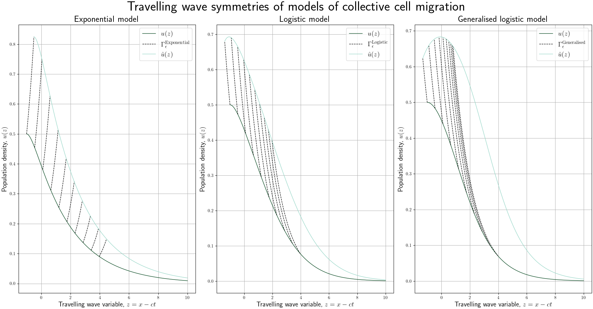

# Model construction of travelling wave models of collective cell migration in two spatial dimensions using Lie symmetries
*Date:* 2023-01-03, 
*Written by:* Johannes Borgqvist. 
We illustrate the symmetries of travelling wave models of collective cell migration in two spatial dimensions. This repositry is an open--source repositry written in Python which contains two scripts:

1. "*plot\_travelling\_wave\_symmetries.py*",
2. "*cell\_migration\_FEM\_simulation.py*".

The first script plots the symmetries of three candidate models referred to as the exponential, logistic and generalised model. The second script simulates collective cell migration in two spatial dimensions by solving a PDE that was constructed based on Lie symmetries.

## Solving the travelling wave ODEs for the three minimal models of collective cell migration
To generate the figure below, just run the script listed in the first bullet point above. 

## Simulating collective cell migration on the unit square
To generate a mesh, initial condition and lastly to solve a reaction-convection-diffusion PDE in two spatial dimensions of collective cell migration, run the script listed in the second bullet point above. This script solves the PDE using [FEniCS](https://fenicsproject.org/). The easiest way to install FEniCS is by using [conda](https://docs.conda.io/en/latest/) and then creating a conda environment using the provided yml-file called *fenicsproject.yml*. To install this environment, type

*conda env create -f fenicsproject.yml* 

. Then, you can activate this environment which is called "*fenicsproject*" by using the command

*conda activate fenicsproject* 

. After this, you should be able to run the FEM simulations of collective cell migration. To deactivate the environment, simply type

*conda deactivate*

. All figures are saved in the folder called Figures. The pvd files as well as the corresponding vtk files that are generated by FEniCS are saved in the Output folder and these can be looked at in [*ParaView*](https://www.paraview.org/). 

